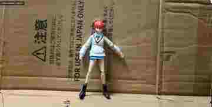

# naonekosennsei

考古学調査・遺跡測量・図面作成をしながら、
フォトグラメトリソフト **PhotoMet** を個人開発しています。

## PhotoMet

写真から3Dモデルを生成し、
考古学・発掘調査での実測図作成までつなげることを目的とした
フォトグラメトリ / 3D測量ソフトです。

### 主な機能

- SfM / カメラアライメント
- Depth / Dense Reconstruction
- メッシュ・テクスチャ生成
- GCP / 測量座標対応
- オルソ画像出力
- レイヤー分けトレース
- Polyline / Spline DXF出力
- 遺構・遺物の実測図作成支援

## 3D復元例

実際のPhotoMetによる3D復元例です。露頭・岩壁のような大規模対象から、小物まで処理できます。

### 北川露頭

  

### 天竜峡・岩壁

<table>
  <tr>
    <td align="center"><b>Texture View</b></td>
    <td align="center"><b>Mesh View</b></td>
  </tr>
  <tr>
    <td width="50%"></td>
    <td width="50%"></td>
  </tr>
</table>

### 小物復元

<table>
  <tr>
    <td align="center"><b>Texture View</b></td>
    <td align="center"><b>Mesh View</b></td>
  </tr>
  <tr>
    <td width="50%"></td>
    <td width="50%"></td>
  </tr>
</table>

## Background

- 考古学発掘調査
- 遺跡測量
- Photogrammetry
- CAD / Illustrator / DTP
- 3D reconstruction software development

## Projects

### PhotoMet
Photogrammetry & measured drawing software for archaeological fieldwork.

### AIクリップ
Illustrator上で、指定した枠を使って線を切るためのツール。

### NyawName
考古学・発掘調査などで扱う大量写真を、確認しながら効率よく整理・一括リネームするためのWindowsツール。RAW/JPEG照合、連番・桁揃え、CSV対照表、PDF一覧作成などに対応。

[Releases / Download](https://github.com/naonekosennsei/Nyaw_Name/releases)
